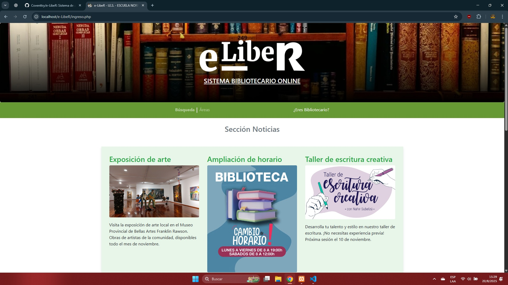
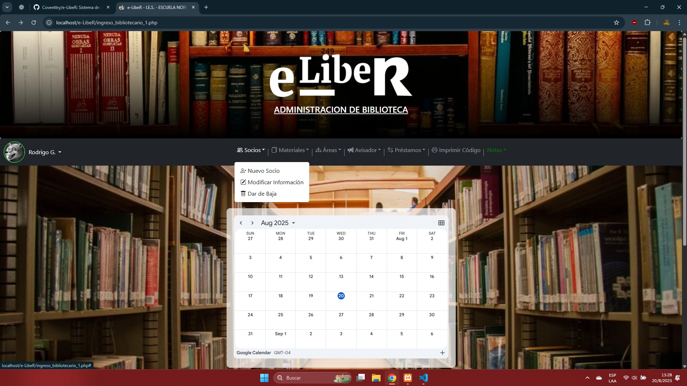
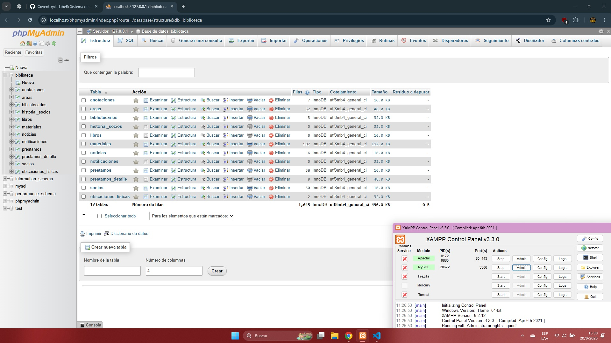

**e-LibeR - Sistema de Gestión Bibliotecaria**

---

#### **Descripción del Proyecto**
**e-LibeR** es un sistema de gestión bibliotecaria diseñado para facilitar la administración de libros, socios y préstamos. Ideal para pequeñas bibliotecas, este proyecto se desarrolla utilizando PHP y MySQL y se ejecuta mediante XAMPP.

---
#### **Vistas Previas del Sistema**

**1. Menú de Ingreso (sin login)**  


**2. Menú de Bibliotecario (ya logueado)**  


**3. Base de Datos en MySQL**  


---

#### **Requisitos Previos**
Antes de comenzar, asegúrate de tener lo siguiente instalado en tu computadora:

1. **XAMPP** (incluye Apache y MySQL).
2. Un navegador web (como Chrome o Firefox).
3. Un editor de texto o IDE (opcional, como Visual Studio Code).

---

#### **Pasos para Descargar e Implementar e-LibeR**

##### 1. **Descargar el Repositorio**
1. Ve a este repositorio en GitHub.
2. Haz clic en el botón **Code** y selecciona **Download ZIP**.
3. Extrae el contenido del archivo ZIP en tu computadora.

---

##### 2. **Configurar XAMPP**
1. Inicia XAMPP y activa los módulos **Apache** y **MySQL**.
2. Copia la carpeta del proyecto (descargada previamente) en la ruta:  
   `C:\xampp\htdocs`  
   La carpeta del proyecto debería llamarse, por ejemplo, `e-libeR`.  
Descarga XAMPP desde: `https://www.apachefriends.org/`.

---

##### 3. **Importar la Base de Datos**
1. Abre tu navegador y dirígete a:  
   `http://localhost/phpmyadmin`
2. Crea una nueva base de datos llamada `biblioteca`.
3. En la base de datos recién creada, haz clic en **Importar**.
4. Selecciona el archivo `biblioteca.sql` que se encuentra en la carpeta del proyecto. **carpeta SQL**
5. Haz clic en **Continuar** para finalizar la importación.

---

##### 4. **Configurar el Archivo de Conexión a la Base de Datos**
1. Abre el archivo de configuración de conexión (por ejemplo, `config.php`) en la carpeta del proyecto.
2. Verifica que los datos de conexión coincidan con los de tu XAMPP:
   ```php
   $host = 'localhost';
   $user = 'root';
   $password = '';
   $database = 'biblioteca';
   ```

---

##### 5. **Ejecutar el Proyecto**
1. Abre tu navegador y dirígete a:  
   `http://localhost/e-libeR`
2. Ahora deberías ver el sistema en funcionamiento.

---

#### **Características del Sistema**
- **Gestión de Materiales**: Agregar, editar y buscar libros.
- **Gestión de Socios**: Registro, edición y visualización de usuarios.
- **Gestión de Préstamos**: Registrar préstamos y devoluciones con actualización automática de disponibilidad.

---

#### **Soporte**
Si encuentras algún problema al implementar o utilizar el sistema, no dudes en crear un **Issue** en este repositorio.

---
##### **Puedes darle un vistazo al video de presentación del Software y agradecimientos a nuestros colaboradores.**
https://drive.google.com/file/d/1zV9WfDTNkJRYRDVegjmEfS1QU5G4Ryh-/view?usp=sharing
---

¡Gracias por aportar al desarrollo de **e-LibeR**! 🚀
consultas al mail: **rodrigogarciafaud@gmail.com**
